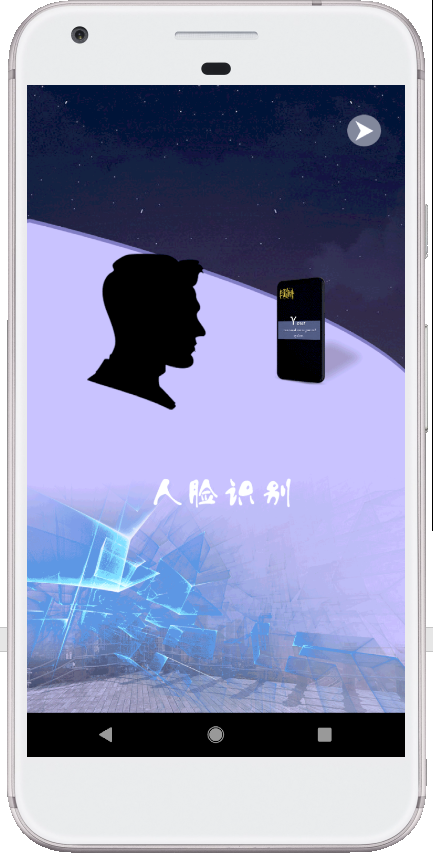

# PasswordShield

一款结合了生物识别的口令管理器。配置了基本的口令管理器功能如口令的添加、编辑、查看、删除，口令生成器等。并将生物识别结合到了 APP 内部的认证中，使用户记忆尽可能少的内容，方便的使用高强度的口令。

## 安装

本项目为开源项目，点击即可下载源码。项目使用`Android Studio 3.4.2`构建。

## 使用

### 初次使用引导

在第一次使用应用时，会出现引导图片介绍应用的特性。请点击右上角的箭头继续。

接下来，需要键入一个主口令以进入页面。主口令是标识用户身份的唯一最终依据，也是用户唯一需要记忆的口令。需要用户选择一个可以记住的口令。用户名用于在 人脸识别 API 中标识不同的用户。

由于APP需要导入系统中的APP图标，所以在第一次启动时可能会有卡顿。

正式进入页面后即证明成功。

### 其他功能

应用还提供了口令生成器、设置等功能，右划打开抽屉栏即可看到。

### 认证

Password Shield 目前支持三种认证方式，如下所示。
* 主口令认证
* 指纹认证
* 人脸认证
  
其中，主口令认证是最基本的认证，而其他的认证方式需要在设置（在主界面中从左向右滑动或点击左上角的图标即可找到）中打开后才可以使用。

指纹认证借由安卓系统提供的API实现，故只能使用已经在系统设置中设定的指纹，如系统不支持指纹识别或暂无指纹会报错提示。

人脸认证通过百度的开放API实现，认证精确度较低。在第一次使用时需要先注册再使用。

*注意：应用通过用户名表示每一个用户，当您使用不同的用户名时需要重新注册人脸。*

